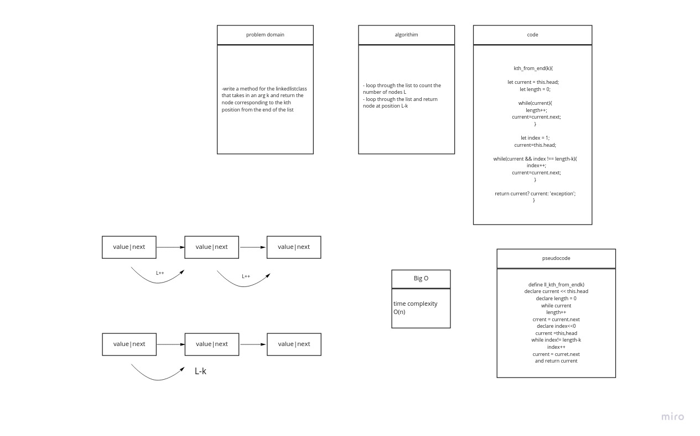

# Linked List

A linked list is a linear data structure where each element is a separate object. Linked list elements are linked using pointers. Each node of a list is made up of two items - the data and a reference to the next node. The last node has a reference to null.

## class-07

## Challenge

Implement Singly Linked List in javascript and implement a way to insert, search and get linked list values.

## Approach & Efficiency

Write the following methods for the Linked List class:

- append(value) which adds a new node with the given value to the end of the list
- insertBefore(value, newVal) which add a new node with the given newValue immediately before the first value node
- .insertAfter(value, newVal) which add a new node with the given newValue immediately after the first value node

### Bog O

- append() -> time complixity: O (n)
- insertBefore() -> time complixity: O (n)
- insertAfter() -> time complixity: O (n)

## API

- Create a new linked list

```javascript
const newLL = new LinkedList();
```

- Add a new node with the given value to the end of the list

```javascript
newLL.append(value); \\return the linked list
```

- Add a new node with the given newValue immediately before the first value node

```javascript
newLL.insertBefore(value,newVal); \\return the linked list
```

- Add a new node with the given newValue immediately after the first value node

```javascript
newLL.insertAfter(value, newVal); \\return the linked list
```

## Solution


