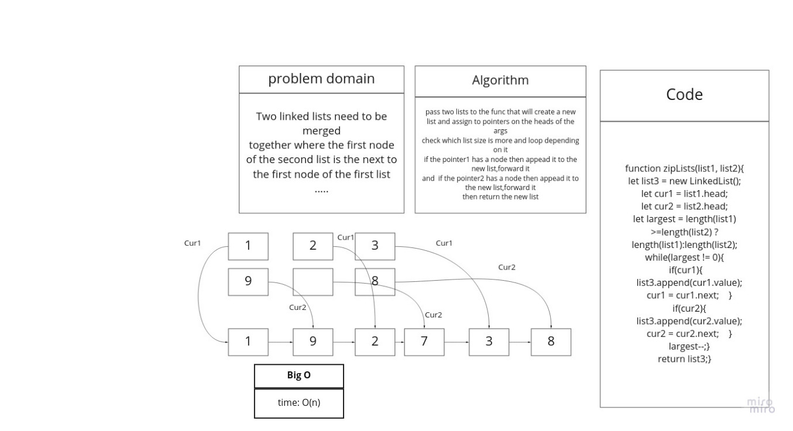

# Linked List

A linked list is a linear data structure where each element is a separate object. Linked list elements are linked using pointers. Each node of a list is made up of two items - the data and a reference to the next node. The last node has a reference to null.

## class-08

## Challenge

Write a function called `zipLists` which takes two linked lists as arguments. Zip the two linked lists together into one so that the nodes alternate between the two lists and return a reference to the head of the zipped list

## Approach & Efficiency

- create zipLists(L1,L2) function
- that wil ;oop through the lists' nodes and merge them into one list
- return the result list

### Bog O

- zipLists() -> time complixity: O(n)

## API

- Create a new linked list

```javascript
const ll1 = new LinkedList();
```

- Add a new node with the given value to the end of the list

```javascript
ll1.append(value);
ll1.append(value);
ll1.append(value);
ll1.append(value);

```

- Create a new linked list

```javascript
const ll2 = new LinkedList();
```

- Add a new node with the given value to the end of the list

```javascript
ll2.append(value);
ll2.append(value);
ll2.append(value);
ll2.append(value);
```

- Pass both lists to the function

```javascript
zipLists(ll1,ll2) //return a merged list
```

## Solution


