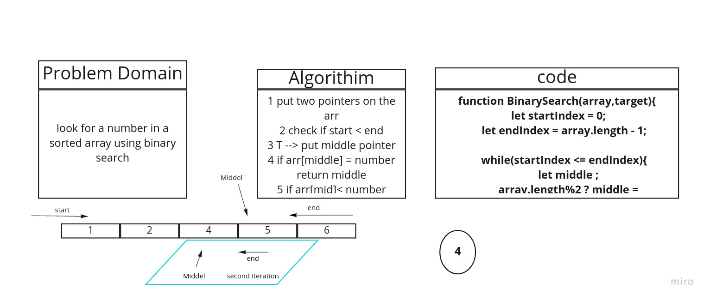

# data-structure-and-algorithim

## Challenge 3 - Binary Search

## summary

This is a function called BinarySearch that finds the position of a targeted value in a sorted array.

## Challenge

Write a function called BinarySearch which takes in 2 parameters: a sorted array and the search key that return the index of the target if it exist or -1 if not.

## Solution

