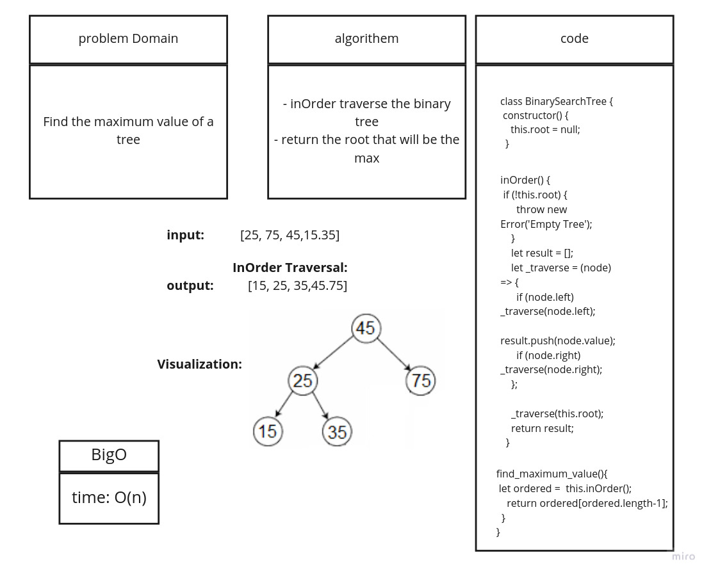

# data-structure-and-algorithim

## BinarySearchTree

- [x] Can successfully instantiate an empty tree
- [x] Can successfully instantiate a tree with a single root node
- [x] Can successfully add a left child and right child to a single root node
- [ ] Can successfully return a collection from a preorder traversal
- [x] Can successfully return a collection from an inorder traversal
- [x] Can successfully return a collection from a postorder traversal

## Find Max Value Test

- [x] Can successfully return MAX value

## Trees

tree is a collection of nodes connected by some edges. A tree is a non linear data structure. A Binary Search tree is a binary tree in which nodes that have lesser value are stored on the left while the nodes with a higher value are stored at the right.

## Challenge

Find max value of a binary tree

## Approach & Efficiency

- Create a new method for the BinarySearchTree class.
- Call the inOrder method so you get the hieghest value as a root.
- return the root.

## Implementation

- Create a new tree

```javascript

var BST = new BinarySearchTree();


```

- Insert the asumed values `2, 7, 5, 2, 6, 5, 11, 5, 9, 4`

```javascript

BST.add(value);

```

- find_maximum_value that will in-order the tree then pick up the root

```javascript
BST.find_maximum_value()
```

## To test the find_maximum_value()

- In your terminal

`npm test __tests__/tree.test.js`

### Bog O

Time complixty: O(n).

- [x] Top-level README “Table of Contents” is updated
- [x] Feature tasks for this challenge are completed
- [x] Unit tests written and passing
  - [x] “Happy Path” - Expected outcome
  - [ ] Expected failure
  - [x] Edge Case (if applicable/obvious)
- [x] README for this challenge is complete
  - [x] Summary, Description, Approach & Efficiency, Solution
  - [x] Link to code
  - [x] Picture of whiteboard


