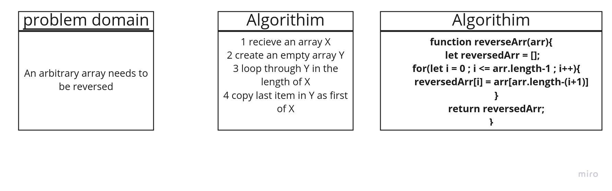
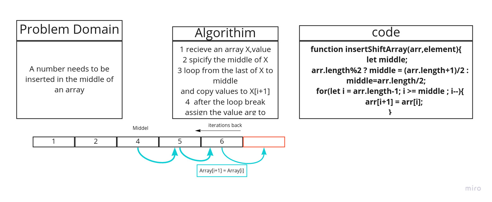

# data-structure-and-algorithim
### 401 Challenges

* [Reverse Array](https://github.com/ahmadkheder-401-advanced-javascript/data-structure-and-algorithim/blob/cc1-reverseArr/challenges/reverseArr.js)
* [Shift Array](https://github.com/ahmadkheder-401-advanced-javascript/data-structure-and-algorithim/blob/cc2-shiftArr/challenges/shiftArr.js)
* [Binary Search Array](https://github.com/ahmadkheder-401-advanced-javascript/data-structure-and-algorithim/blob/5648bba167f4dcedb934cc94794509dee6ef005b/challenges/binaryArr.js)
* [ll-kth-from-end
](https://github.com/ahmadkheder-401-advanced-javascript/data-structure-and-algorithim/blob/ll-kth-from-end/challenges/ll-kth-from-end.js)
* [ll-insertions](https://github.com/ahmadkheder-401-advanced-javascript/data-structure-and-algorithim/blob/ll-insertions/challenges/ll-insertions.js)
* [ll-zip](https://github.com/ahmadkheder-401-advanced-javascript/data-structure-and-algorithim/tree/ll-zip)
* [queue-with-stacks](https://github.com/ahmadkheder-401-advanced-javascript/data-structure-and-algorithim/tree/queue-with-stacks/challenges/queue-with-stacks)
* [stack-and-queue](https://github.com/ahmadkheder-401-advanced-javascript/data-structure-and-algorithim/tree/stack-and-queue/challenges/stacksAndQueues)
* [fifo-animal-shelter](https://github.com/ahmadkheder-401-advanced-javascript/data-structure-and-algorithim/tree/fifo-animal-shelter/challenges)
* [tree](https://github.com/ahmadkheder-401-advanced-javascript/data-structure-and-algorithim/tree/tree/challenges/tree)
* [multi-bracket-validation](https://github.com/ahmadkheder-401-advanced-javascript/data-structure-and-algorithim/tree/multi-bracket-validation/challenges/multiBracketValidation)
* [find-maximum-binary-tree](https://github.com/ahmadkheder-401-advanced-javascript/data-structure-and-algorithim/tree/find-maximum-binary-tree)
* [ffizzbuzz-tree](https://github.com/ahmadkheder-401-advanced-javascript/data-structure-and-algorithim/tree/fizzbuzz-tree)
### react-part
* [InsertionSort](https://github.com/ahmadkheder-401-advanced-javascript/data-structure-and-algorithim/tree/insertion-sort)
* [MergeSort](https://github.com/ahmadkheder-401-advanced-javascript/data-structure-and-algorithim/tree/merge-sort)
* [quick-sort](https://github.com/ahmadkheder-401-advanced-javascript/data-structure-and-algorithim/tree/quick-sort)
* [hashTable](https://github.com/ahmadkheder-401-advanced-javascript/data-structure-and-algorithim/tree/hashTable/react-challenges/hashtable)

