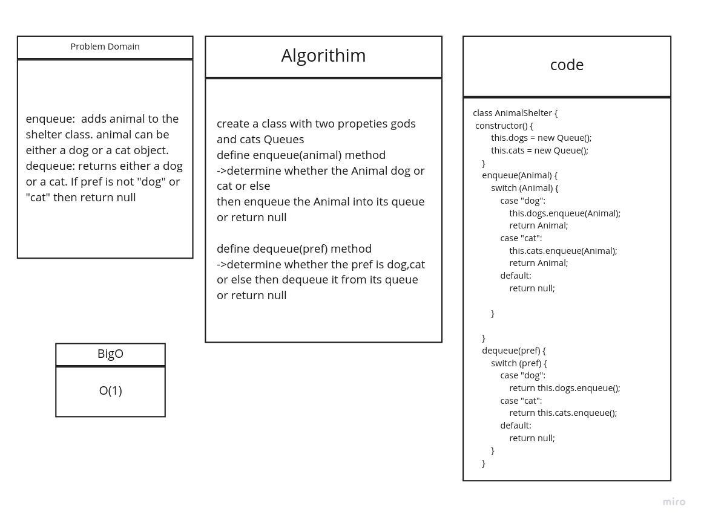

# fifoAnimalShelter
# Challenge Summary
create a class that will take in cats and dogs and return a cat or dog based on queue behavior and user preference

## Challenge Description
Create a class called AnimalShelter which holds only dogs and cats. The shelter operates using a first-in, first-out approach.

Implement the following methods:

* `enqueue(animal)`: adds animal to the shelter. animal can be either a dog or a cat object.

* `dequeue(pref)`: returns either a dog or a cat. If pref is not "dog" or "cat" then return null.

## Approach & Efficiency
To solve this we decided to create two queues in our function to handle the two different choices of animals. We would validate what we are getting and enqueue them to the queue. To dequeue,  we would check that the type exists and return it to the user with a congratualatory string.

## Solution

