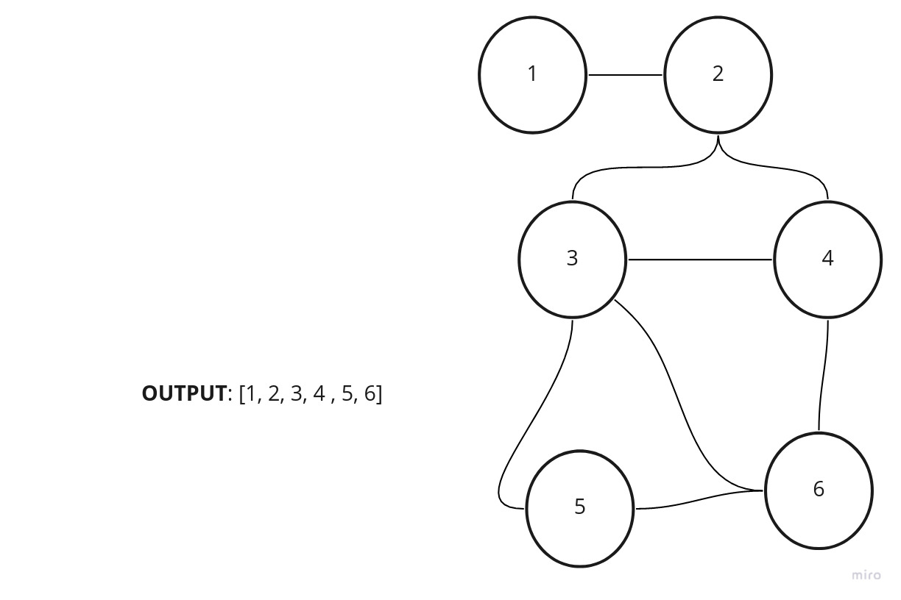

# Graph

## Challenge

Extend your graph object with a breadth-first traversal method that accepts a starting node.
return a collection of nodes in the order they were visited. Display the collection.

## Approach & Efficiency

I used for Classes ,for and while loops , if statment

## Solution

**Problem Domain:**

implement Breadth First on the graph

**Algorithm:**

- creat a function that takes in an argument
- create a node and new set 
- push the node and add it to the set
- loop through the array
- check the neihgbors to the node after pop it
- loop through the neighbors and push them to an array
- return the node as an array

**Visualization**

**input:** graph
**output:** array

**Big O:**

space(n)
time(n^2)

